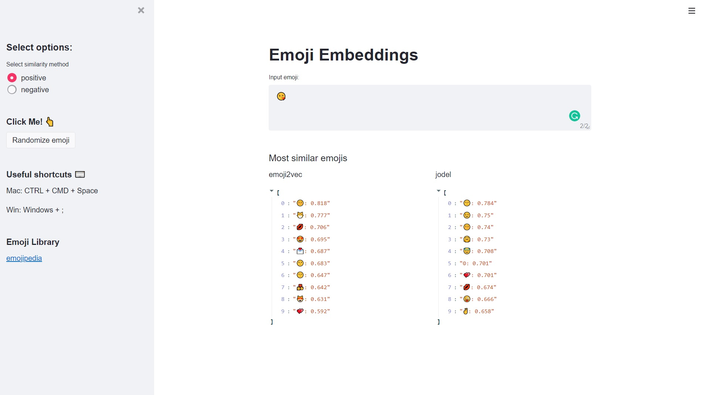

# emoji_embeddings

### Introduction
This web app is created to compare the difference between two emoji embeddings models [Emoji2Vec](https://arxiv.org/pdf/1609.08359.pdf) and [Jodel](https://arxiv.org/pdf/2006.01207.pdf). It is served to help with better visualisation of their results by showing the top 10 most similar emojis to the inputted emoji.

Emoji2Vec embeddings are learned from the emojis' descriptions in the Unicode emoji standard while Jodel embeddings are learned from a large scale messaging data based on their word-emoji cooccurrence. Both models map emoji to a 300-dimensional embedding vector.


### Downloading pre-trained embeddings for emoji embeddings 
In the root of the repository run the following commands in terminal to download the pre-trained embeddings:
```
mkdir embeddings
curl https://github.com/uclnlp/emoji2vec/raw/master/pre-trained/emoji2vec.bin -o embeddings/emoji2vec.bin
curl https://github.com/tuedelue/jeed/raw/master/jeed1488.keyed_vecors.bin -o embeddings/jeed1488.keyed_vecors.bin
```
The files should appear in the following directory.
```
├─ README.md
├─ embeddings
│   ├─ emoji2vec.bin
│   └─ jeed1488.keyed_vecors.bin
└─ src
    └─ emoji_streamlit.py
```

### Basic Usage
#### Step 1:
Clone the repository 
```
git clone https://github.com/sngjoy/emoji_embeddings.git
cd emoji_embeddings
```
#### Step 2:
Download and save emoji embeddings as described above.

#### Step 3:
Install required packages

```
pip install -r requirements.txt
```
#### Step 4: 
Run the app!
```
streamlit run src/emoji_streamlit.py

### Screenshot

